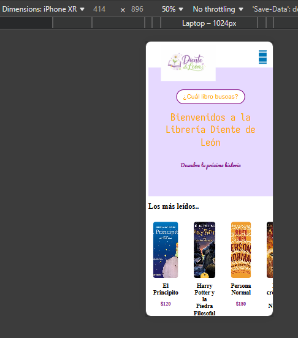
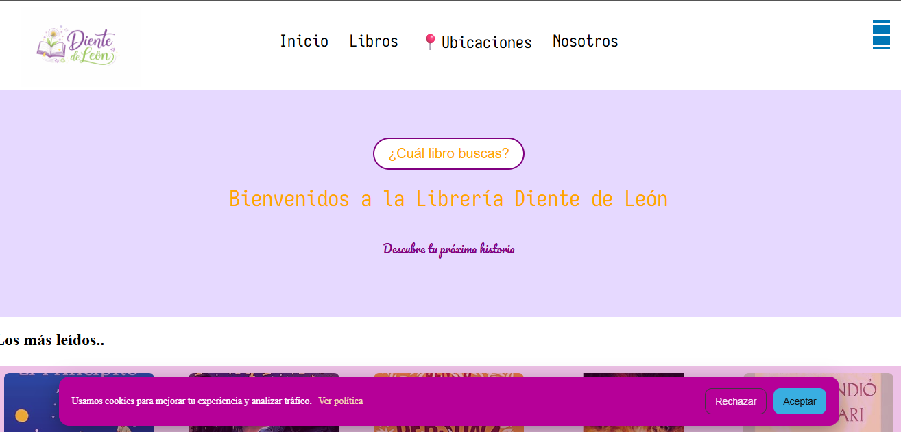
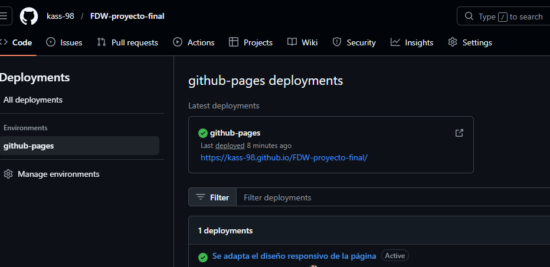

# Evidencias del Proyecto
Página web de una librería ficticia llamada “Librería Diente de León”, donde se aplicó conocimientos de HTML, CSS y diseño responsivo.

### Vista móvil

### Vista desktop

### GitHub Pages activo

## 📚 Aprendizajes

### 1. ¿Qué fue lo más fácil y lo más retador?
Lo más fácil fue estructurar el HTML. Lo más retador fue ajustar el diseño responsivo y footer.

### 2. ¿Qué usaste de HTML semántico y Flexbox?
Usé `header`, `main`, `section` y `footer`. Flexbox para alinear navbar y footer.

### 3. ¿Cómo organizaste media queries?
Organicé las media queries principalmente para adaptar la navegación, el footer y el banner de cookies a dispositivos móviles. Utilicé un breakpoint de 768px para cambiar la disposición de elementos como el menú (hamburguesa), el footer en columna y el banner de cookies en formato vertical para mejorar la experiencia en pantallas pequeñas.

### 4. ¿Qué mejorarías?
Me gustaría mejorar la responsividad en más tamaños de pantalla, optimizando el diseño para tablets y dispositivos más pequeños. También agregaría más interactividad en la página, como animaciones suaves, mejor experiencia en botones.